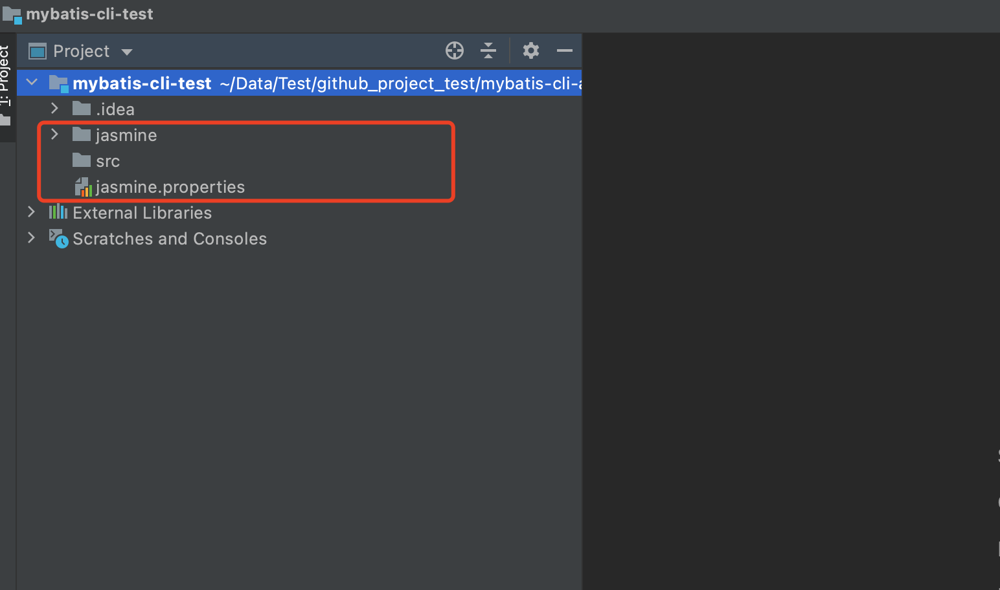

# mybatis-cli

## mybatis-cli 安装

```
npm i mybatis-cli -g
```


## mybatis-cli 使用

1、mybatis-cli 初始化配置。

```
# 新建并进入 mybatis-cli-test 文件夹
mkdir mybatis-cli-test && cd mybatis-cli-test

# mybatis-cli 初始化
mybatis-cli i
```



2、配置数据库。


3、生成Entity、Mappper、xml。

```
mybatis-cli g
```


4、Entity、Mappper、xml新增部分写在下面 "The above part of the comment..." 下面。


5、如果数据库字段有更新，在相应文件夹下再次执行 "mybatis-cli g" 命令。

