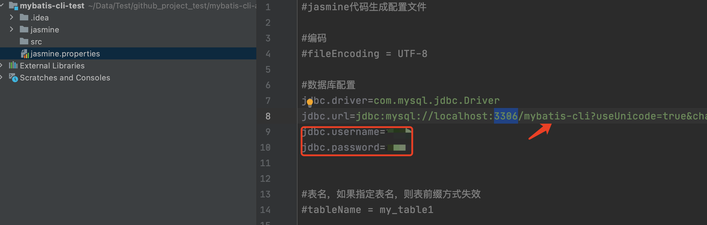
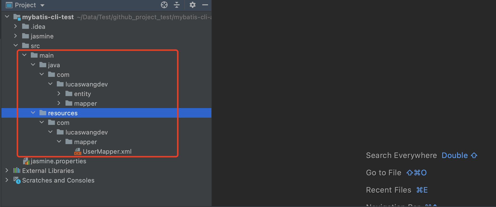
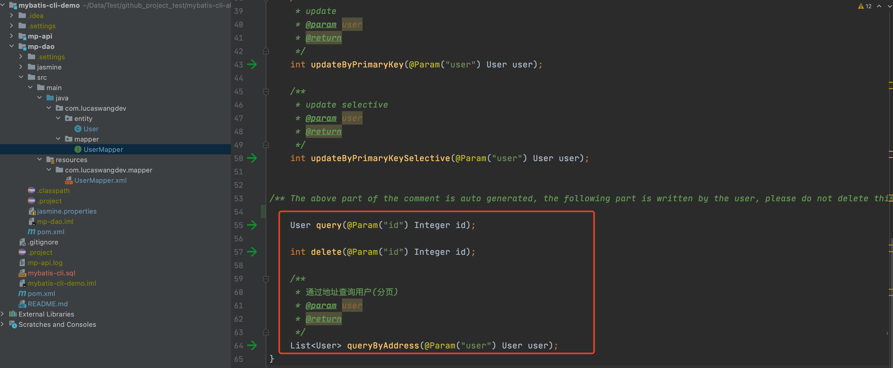

# mybatis-cli

[中文说明/Chinese Documentation](README_CN.md)

## install

With [npm](https://www.npmjs.com/) do:

```
npm i mybatis-cli -g
```


## usage
```
                      _               _     _                        _   _
  _ __ ___    _   _  | |__     __ _  | |_  (_)  ___            ___  | | (_)
 | '_ ` _ \  | | | | | '_ \   / _` | | __| | | / __|  _____   / __| | | | |
 | | | | | | | |_| | | |_) | | (_| | | |_  | | \__ \ |_____| | (__  | | | |
 |_| |_| |_|  \__, | |_.__/   \__,_|  \__| |_| |___/          \___| |_| |_|
              |___/
mybatis-cli <cmd> [args]

command:
  mybatis-cli i  mybatis-cli init, generate config file
  mybatis-cli g  generate mybatis entity、mapper、xml
  mybatis-cli u  generate and update mybatis entity、mapper、xml

options:
  --version  show version number                                               
  --help     show help information                                               
```

### 1. Mybatis-cli initialization configuration.

```
# Create and enter the mybatis-cli-test folder
mkdir mybatis-cli-test && cd mybatis-cli-test

# mybatis-cli initialization
mybatis-cli i
```


### 2. Configure the database.



### 3. Generate Entity, Mapper, xml.

```
mybatis-cli g
```



### 4. The new part of Entity, Mapper, and xml is written below "The above part of the comment..." below.



### 5. If the database fields are updated, execute the "mybatis-cli u" command again in the corresponding folder.
```
mybatis-cli u
```
