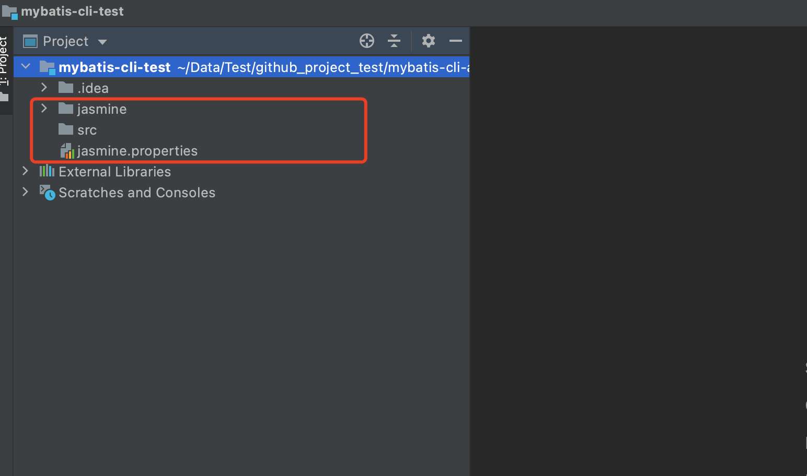
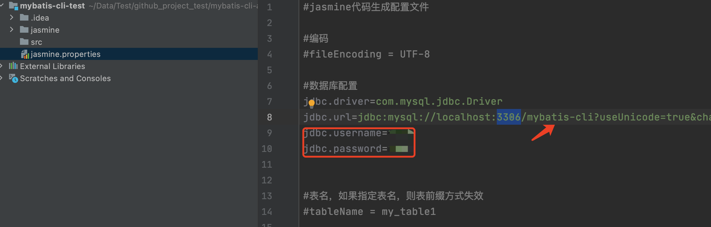
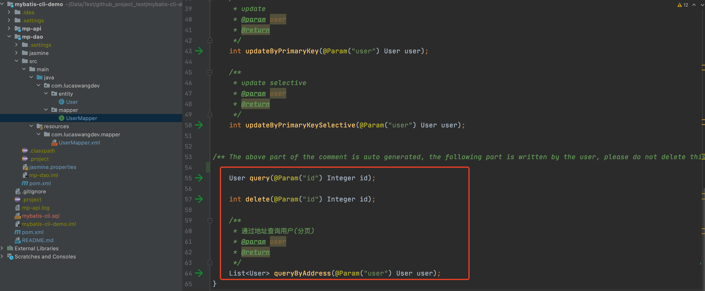

# mybatis-cli

## 安装
使用 [npm](https://www.npmjs.com/) 执行:

```
npm i mybatis-cli -g
```

## 使用
```
                      _               _     _                        _   _
  _ __ ___    _   _  | |__     __ _  | |_  (_)  ___            ___  | | (_)
 | '_ ` _ \  | | | | | '_ \   / _` | | __| | | / __|  _____   / __| | | | |
 | | | | | | | |_| | | |_) | | (_| | | |_  | | \__ \ |_____| | (__  | | | |
 |_| |_| |_|  \__, | |_.__/   \__,_|  \__| |_| |___/          \___| |_| |_|
              |___/
mybatis-cli <cmd> [args]

命令：
  mybatis-cli i  初始化生成 mybatis entity、mapper、xml
  mybatis-cli g  更新 mybatis entity、mapper、xml

选项：
  --version  显示版本号                                                   
  --help     显示帮助信息
```
### 1、mybatis-cli 初始化配置。

```
# 新建并进入 mybatis-cli-test 文件夹
mkdir mybatis-cli-test && cd mybatis-cli-test

# mybatis-cli 初始化
mybatis-cli i
```



### 2、配置数据库。



### 3、生成Entity、Mappper、xml。

```
mybatis-cli g
```


### 4、Entity、Mappper、xml新增部分写在下面 "The above part of the comment..." 下面。



### 5、如果数据库字段有更新，在相应文件夹下再次执行 "mybatis-cli g" 命令。

